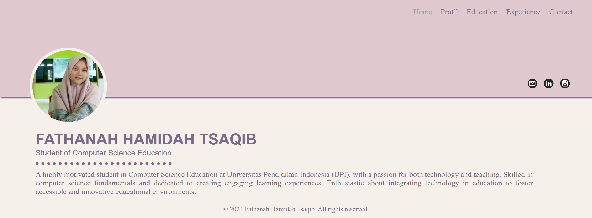
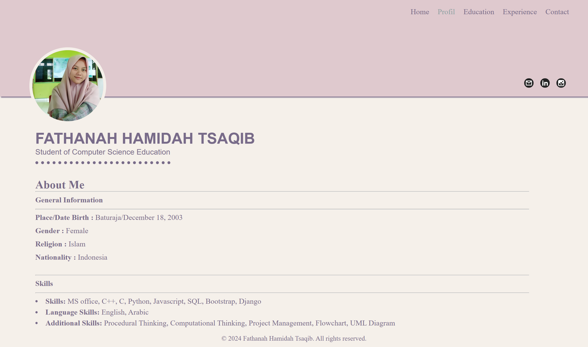
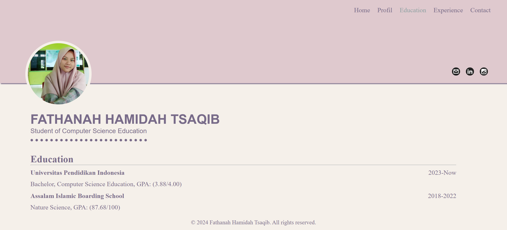
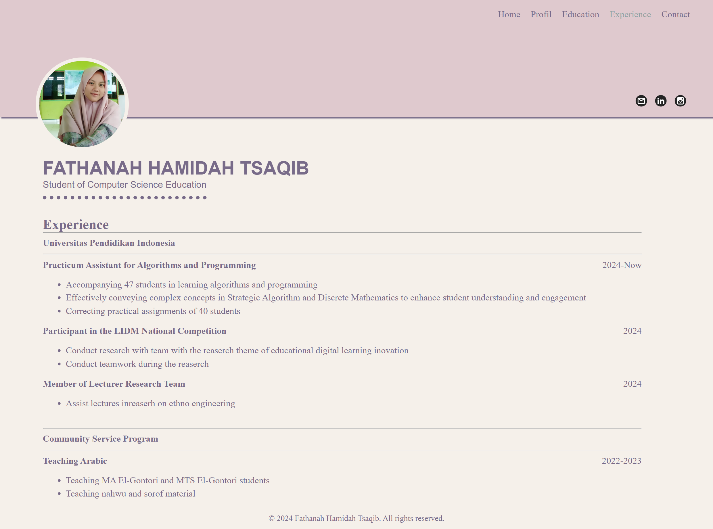
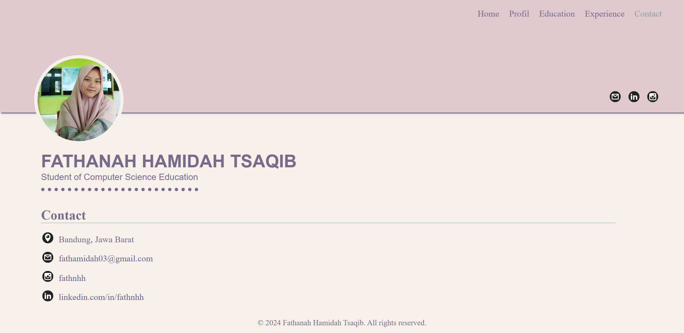

# Portofolio Menggunakan Django
Portofolio ini dibuat untuk memenuhi tugas mata kuliah Pemrograman Internet

## Instal Django
> **Note:** Pastikan python dan PIP sudah terinstall

- Buat Virtual Environment
```
python -m venv [nama_virtual_env]
```
- Aktifkan Virtual Environment
```
[nama_virtual_env]\Scripts\activate
```
- Install Django
```
pip install django
```
- Mulai Proyek Django Baru
```
django-admin startproject [nama_project]
```
- Masuk ke Direktori Proyek
```
cd [nama_project]
```
- Jalankan Server Pengembangan Django
```
python manage.py runserver
```
Jika semuanya berjalan dengan benar, anda akan melihat pesan bahwa server sedang berjalan di ```http://127.0.0.1:8000/```.

## Hasil
- Halaman home

- Halaman Profil

- Halaman Education

- Halaman Experience

- Halaman Contact


## Dibuat Oleh
Nama: Fathanah Hamidah Tsaqib\
NIM: 2304536\
Program Studi: Pendidikan Ilmu Kompueter
